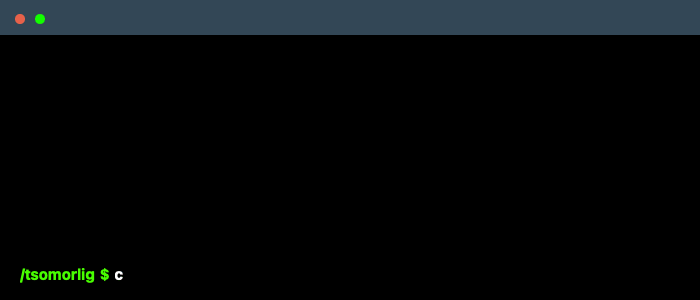

## Hello, hello 👋👋 

I’m **Tsomorlig** , I’m a **Data Engineer** with a **B.S. in Software Engineering**, currently pursuing my **M.S. in Engineering Science (Data Science)**. 

**I excel in Cloud-Native Data Engineering & MLOps**

I bridge the gap between complex data modeling and high-availability system architecture. With a background leading teams to maintain 99.9% uptime for microservices and implementing MLOps from scratch, I specialize in building resilient, automated data ecosystems. 

<!--
    Hey there, I'm Tsomorlig Khishigbold!
    Happy to see you here exploring my README code
    Feel free to get inspiration!
    
    I was also inspired by the awesome @daria-stanilevici 
-->

<!--
    Your own Terminal GIF can be created here -> https://www.terminalgif.com
-->

    

<!--
     My mission, because I'm a superhero!
-->
<!--
     This is the list of my skills and tools I am studying!
-->
### Main skills

### Studying

### Connect with me!

    
    <a href="https://www.credly.com/users/tsomorlig-khishigbold">
        

### Employer?
> [!IMPORTANT]  
> <a href="https://docs.google.com/document/d/1xrVG80HHACq2HyWTkbILifScb6ehs1pz/edit?usp=share_link&ouid=100000751235040802892&rtpof=true&sd=true" download>Download my resume</a>

<!--
     Thanks for being my guest 
-->
