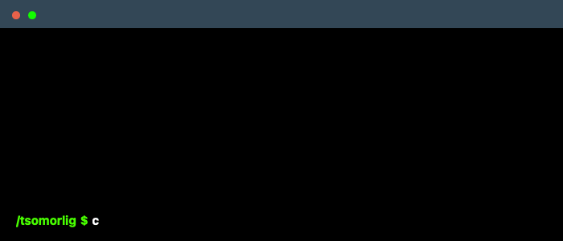

## Hi there, I'm Tsomorlig (Summer) 👋👋 
I’m a **Data Scientist** pursuing **M.S. in Data Science** at University at Buffalo. 

Before diving deep into advanced ML models, I spent **5+ years architecting and scaling mission-critical, high-scale enterprise infrastructure** in the banking sector—managing 300+ microservices for 2M+ active users and building secure, production grade Kubernetes platforms.

**My mission as a data scientist is to not just build great machine learning models in a Jupyter Notebook, but to leverage my experience in systems engineering, DevOps, and cloud expertise required to scale, secure, and productionalize them for enterprise deployment.**
<!--
    Happy to see you here exploring my README code
    Feel free to get inspiration!
    
    My ReadMe was inspired by the awesome @daria-stanilevici 
-->

<!--
    Your own Terminal GIF can be created here -> https://www.terminalgif.com
-->

### Core skills

### Studying

    

### Connect with me!

    
    <a href="https://www.credly.com/users/tsomorlig-khishigbold">
        

### Employer?
> [!IMPORTANT]  
> <a href="https://docs.google.com/document/d/1xrVG80HHACq2HyWTkbILifScb6ehs1pz/edit?usp=share_link&ouid=100000751235040802892&rtpof=true&sd=true" download>Download my resume</a>

<!--
     Thanks for being my guest 
-->
